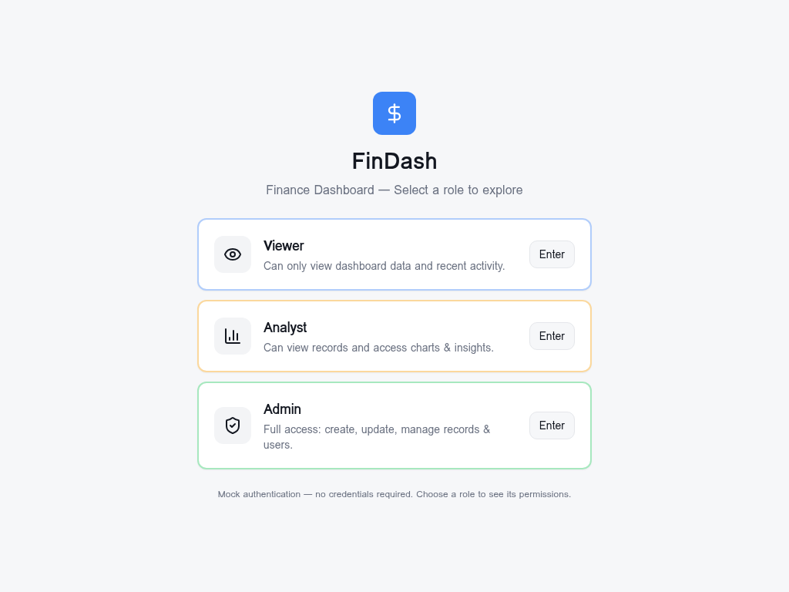
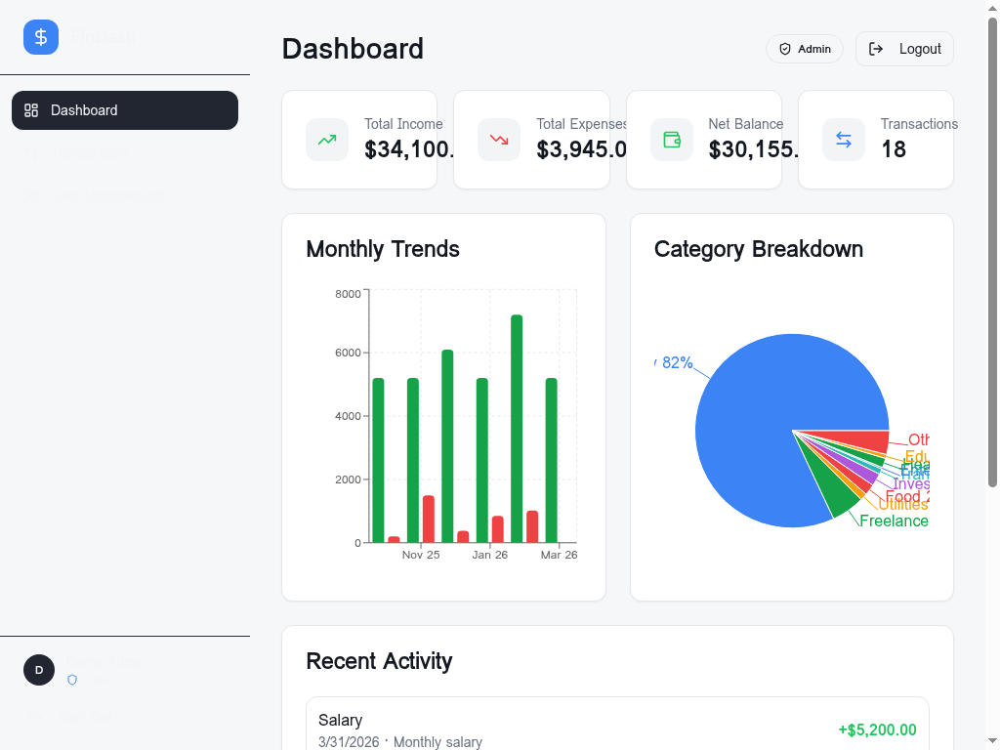
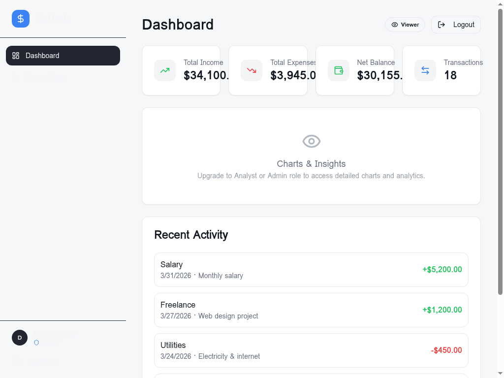

# FinDash — Finance Dashboard with User Management and Access Control

A React + TypeScript finance dashboard with user creation, role assignment, active/inactive status handling, and role-based access control.

## Key User Management Features

- Create new users with Supabase authentication via `/signup`
- Assign roles to users using the admin-only User Management page
- Activate or deactivate users from the same admin panel
- Restrict UI and API access based on roles (`admin`, `analyst`, `viewer`)
- Support for backend policies via Supabase RLS using `profiles` and `user_roles`

## Screenshots

### Login Page — Role Selection
Users can choose a demo role to view the dashboard quickly.

### Admin Dashboard — Full Access
Admins can access charts, transactions and user management.

### Viewer Dashboard — Restricted Access
Viewers see only summary cards and recent activity.

## Architecture

Frontend (React + TypeScript + Vite)
  ├── Pages: Dashboard, Transactions, User Management, Login, Signup
  ├── Auth Context: Mock role selection plus Supabase auth support
  ├── Protected Routes: Role-gated navigation
  └── Optional mock/demo data for quick preview

Backend (Lovable Cloud / Supabase)
  ├── Tables: `profiles`, `user_roles`, `transactions`
  ├── RLS Policies: row-level security per role
  ├── Function: `has_role()` security definer
  └── Triggers: auto-create profile and default `viewer` role on signup

## Backend Support for User Management

The Supabase backend schema supports:

- Creating users through `supabase.auth.signUp()`
- Automatically creating a `profiles` row for each new user
- Automatically creating a default `viewer` role in `user_roles`
- Assigning roles in the admin User Management page (`admin`, `analyst`, `viewer`)
- Marking users active/inactive via `profiles.is_active`
- Restricting actions using RLS policies and role checks

## Database Schema

### `profiles`
| Column | Type | Description |
|---|---|---|
| `id` | `uuid` | Primary key |
| `user_id` | `uuid` | References `auth.users(id)` |
| `display_name` | `text` | User-friendly name |
| `avatar_url` | `text` | Profile image URL |
| `is_active` | `boolean` | Active status, default `true` |
| `created_at` | `timestamptz` | Auto-set timestamp |
| `updated_at` | `timestamptz` | Auto-updated timestamp |

### `user_roles`
| Column | Type | Description |
|---|---|---|
| `id` | `uuid` | Primary key |
| `user_id` | `uuid` | References `auth.users(id)` |
| `role` | `app_role` | `admin`, `analyst`, or `viewer` |

### `transactions`
| Column | Type | Description |
|---|---|---|
| `id` | `uuid` | Primary key |
| `user_id` | `uuid` | Owner reference |
| `amount` | `numeric` | Transaction amount |
| `type` | `text` | `income` or `expense` |
| `category` | `text` | Category label |
| `date` | `date` | Transaction date |
| `notes` | `text` | Optional description |
| `is_deleted` | `boolean` | Soft delete flag |
| `created_at` | `timestamptz` | Auto-set timestamp |
| `updated_at` | `timestamptz` | Auto-updated timestamp |

## Role-Based Access Control

| Feature | Viewer | Analyst | Admin |
|---|:---:|:---:|:---:|
| View dashboard summary cards | ✅ | ✅ | ✅ |
| View recent activity | ✅ | ✅ | ✅ |
| View charts & analytics | ❌ | ✅ | ✅ |
| View transaction records | ✅ | ✅ | ✅ |
| Create transactions | ✅ | ✅ | ✅ |
| Edit transactions | ✅ | ✅ | ✅ |
| Delete transactions | ❌ | ❌ | ✅ |
| Manage users & roles | ❌ | ❌ | ✅ |
| Create user records | ❌ | ❌ | ✅ |

## API / Backend Behavior

- `supabase.auth.signUp()` creates a new user and automatically seeds `profiles` and `user_roles`
- `supabase.auth.signInWithPassword()` is the intended login flow for backend-backed users
- `supabase.auth.signOut()` logs the user out
- `supabase.from('profiles')` is used to query and update user status
- `supabase.from('user_roles')` is used to assign and update roles
- `supabase.from('transactions')` is used for transaction CRUD operations

## APIs Used

The application uses the following Supabase client APIs:

- **Authentication:**
  - `supabase.auth.signUp(email, password, options)` - Create new user account
  - `supabase.auth.signInWithPassword(email, password)` - Sign in existing user
  - `supabase.auth.signOut()` - Sign out current user

- **Database Operations:**
  - `supabase.from('profiles').select()` - Fetch user profiles
  - `supabase.from('profiles').update({ is_active: boolean })` - Toggle user active status
  - `supabase.from('user_roles').select()` - Fetch user roles
  - `supabase.from('user_roles').update({ role: string })` - Update user role
  - `supabase.from('transactions').select()` - Fetch transactions
  - `supabase.from('transactions').insert(data)` - Create new transaction
  - `supabase.from('transactions').update(data)` - Update existing transaction
  - `supabase.from('transactions').update({ is_deleted: true })` - Soft delete transaction

- **Row Level Security Functions:**
  - `public.has_role(user_id, role)` - Check if user has specific role

## Data Entry & Management

- All roles (viewer, analyst, admin) can create and edit transaction records.
- Only admins can delete transactions or manage user roles/status.
- Admins can create new user records via the User Management page.
- Filters, search, and pagination help manage transaction data.

### Role-based policies

- `public.has_role(user_id, 'admin')` enables admin-only access
- Admins can view and manage all `profiles` and `user_roles`
- Admins can create new user records
- All authenticated users can create and update transactions
- Only admins can delete transactions
- Authenticated users can view non-deleted transactions

## Setup & Running

1. Clone the repository
2. Install dependencies:
   - `npm install`
3. Run the app:
   - `npm run dev`
4. Open `http://localhost:5173`
5. Select a role (viewer, analyst, or admin) to explore data entry and management features
6. All roles can create and edit transactions; admins can delete records and manage users

## Assumptions & Tradeoffs

- **All roles can manage transactions:** viewers, analysts, and admins can create and edit transaction records for full data management.
- **Admin-only delete and user management:** only admins can delete transactions or manage user roles/status.
- **Admin can create user records:** via the User Management page for demo purposes.
- **Mock auth for demo:** role selection provides quick access without credentials for evaluation.
- **Backend support available:** Supabase schema supports real authentication, roles, and policies when needed.
- **Client-side demo data:** mock transactions enable immediate dashboard preview.
